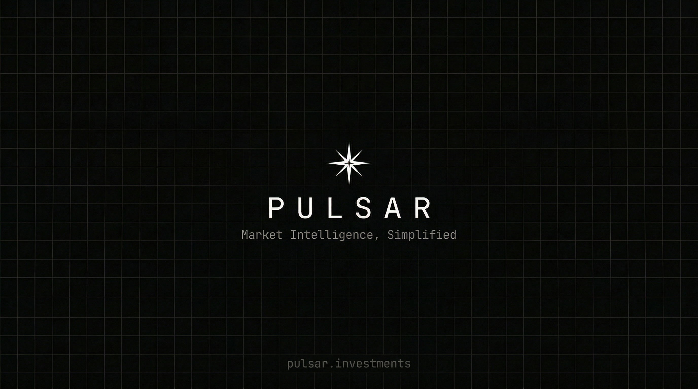

<p align="center">
  
</p>

<p align="center">
  <strong>Real-time Market Intelligence Platform</strong>
</p>

<p align="center">
  <a href="https://pulsar.investments">pulsar.investments</a>
</p>

---

## What is Pulsar

Pulsar is a market intelligence platform for tracking US stocks, Turkish gold and currency prices, portfolios, and custom trading workspaces. All in real time.

Built with a FastAPI backend streaming live data via WebSockets, and a Next.js frontend with drag-and-drop terminal workspaces, candlestick charts, and bank rate comparison tools.

## Features

```
Real-Time Stocks        Live US market data via Alpaca SIP feed (NYSE, NASDAQ, Cboe, IEX)
Turkish Currencies      Gold, silver, USD, EUR, GBP prices from 38+ banks via doviz.com
Portfolio Tracking      Track holdings in USD and TRY with live P&L
Market Heatmaps         Sector performance and custom watchlist heatmaps
Company Financials      Earnings calendar, analyst ratings, quality scores via Finnhub
Custom Terminal         Drag-and-drop workspace with charts, watchlists, news, bank rates
Bank Rate Comparison    Buy/sell/spread/margin from 38 Turkish banks side by side
Floating Calculator     Persistent calculator that stays across page navigation
```

## Stack

```
Backend                 Python, FastAPI, Motor (async MongoDB), Redis pub/sub, httpx
Frontend                Next.js 16, React 19, TypeScript, Tailwind CSS, Zustand
Charts                  Lightweight Charts (TradingView)
Real-Time               WebSockets (Alpaca SIP + doviz.com)
Fonts                   Space Grotesk (body) + Space Mono (headings, data)
Deployment              Vercel (frontend) + Coolify (backend) + Cloudflare (DNS, R2)
```

## Data Sources

<table>
<tr>
<td align="center"></td>
<td align="center"></td>
<td align="center"></td>
<td align="center"></td>
<td align="center"></td>
</tr>
<tr>
<td align="center"><sub>NASDAQ</sub></td>
<td align="center"><sub>NYSE</sub></td>
<td align="center"><sub>Cboe</sub></td>
<td align="center"><sub>BIST</sub></td>
<td align="center"><sub>Binance</sub></td>
</tr>
</table>

```
Alpaca          US stocks, ETFs — real-time SIP feed + historical bars (1m to monthly)
Binance         Real-time cryptocurrency prices and 24h market data
doviz.com       Turkish gold (17 variants), silver, USD, EUR, GBP from 38 banks
Finnhub         Earnings calendar, analyst recommendations, EPS/revenue estimates, quality scores
```

## Markets & Assets

```
Exchanges               NYSE, NASDAQ, Cboe, IEX, NYSE Arca, NYSE American
Stocks                  80+ US equities across 10 sectors
Gold                    Gram, Ceyrek, Yarim, Tam, Cumhuriyet, Ata, Resat, Ons + more
Silver                  USD/oz spot price
Currencies              USD, EUR, GBP (buy/sell from each bank)
Indices                 BIST 100
```

## Terminal

The terminal is a fully customizable workspace with drag-and-drop widgets:

```
Chart                   Full candlestick chart with 8 intervals and 8 time ranges
Mini Chart              Compact area chart for quick overview
Watchlist               Live price feed with change indicators
News Feed               Market news from Alpaca
Portfolio               Positions with live P&L
Heatmap                 Custom stock/currency heatmaps
Bank Rates              Buy/sell/spread/margin comparison across banks
```

Supports 3 switchable terminal pages (T1, T2, T3) saved per user.

---

<p align="center">
  <sub>v1.0 Beta</sub>
</p>
